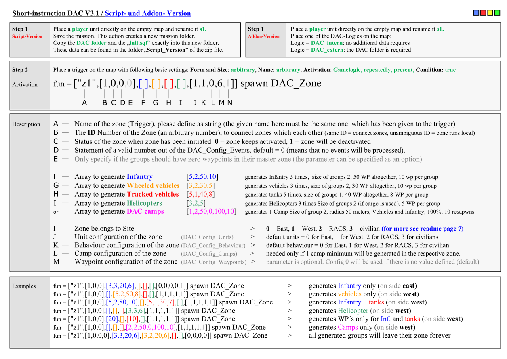
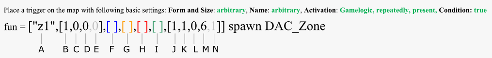

Short Instructions
===============================

In this article:
	- `Setup script version`_
	- `Setup addon version`_
	- `Activation`_
	- `Description`_
	- `Examples`_

Setup script version
--------------------

Place a player unit directly on the empty map and rename it s1.

Save the mission. This action creates a new mission folder.

Copy the DAC folder and the „init.sqf“ exactly into this new folder.

These data can be found in the folder „Script_Version“ of the zip file.

Setup addon version
-------------------

Place a player unit directly on the empty map and rename it s1.

Place one of the DAC-Logics on the map:

Logic = DAC_intern: no additional data requires

Logic = DAC_extern: the DAC folder is required

Activation
----------

Place a trigger on the map with following basic settings: Form and Size: arbitrary, Name: arbitrary, Activation: Gamelogic, repeatedly, present, Condition: true

fun = ["z1",[1,0,0,0],[ ],[ ],[ ],[ ],[1,1,0,6,1]] spawn DAC_Zone

Description
-----------

A - Name of the zone (Trigger), please define as string (the given name here must be the same one which has been given to the trigger)

B - The ID Number of the Zone (an arbitrary number), to connect zones which each other (same ID = connect zones, unambiguous ID = zone runs local)

C - Status of the zone when zone has been initiated. 0 = zone keeps activated, 1 = zone will be deactivated

D - Statement of a valid number out of the DAC_Config_Events, default = 0 (means that no events will be processed).

E - Only specify if the groups should have zero waypoints in their master zone (the parameter can be specified as an option).

F - Array to generate Infantry - [5,2,50,10] - generates Infantry 5 times, size of groups 2, 50 WP altogether, 10 wp per group

G - Array to generate Wheeled vehicles - [3,2,30,5] - generates vehicles 3 times, size of groups 2, 30 WP altogether, 10 wp per group

H - Array to generate Tracked vehicles - [5,1,40,8] - generates tanks 5 times, size of groups 1, 40 WP altogether, 8 WP per group

I - Array to generate Helicopters - [3,2,5] - generates Helicopters 3 times Size of groups 2 (if cargo is used), 5 WP per group 

or - Array to generate DAC camps - [1,2,50,0,100,10] - generates 1 Camp Size of group 2, radius 50 meters, Vehicles and Infantry, 100%, 10 resapwns

I - Zone belongs to Site > 0 = East, 1 = West, 2 = RACS, 3 = civilian (for more see readme page 7)

J - Unit configuration of the zone - (DAC_Config_Units) > default units = 0 for East, 1 for West, 2 for RACS, 3 for civilians

K - Behaviour configuration of the zone - (DAC_Config_Behaviour) > default behaviour = 0 for East, 1 for West, 2 for RACS, 3 for civilian

L - Camp configuration of the zone - (DAC_Config_Camps) > needed only if 1 camp minimum will be generated in the respective zone.

M - Waypoint configuration of the zone - (DAC_Config_Waypoints) > parameter is optional. Config 0 will be used if there is no value defined (default)

Examples
--------
fun = ["z1",[1,0,0],[3,3,20,6],[],[],[],[0,0,0,0,1]] spawn DAC_Zone > generates Infantry only (on side east)

fun = ["z1",[1,0,0],[],[5,2,50,8],[],[],[1,1,1,1,1]] spawn DAC_Zone > generates vehicles only (on side west)

fun = ["z1",[1,0,0],[5,2,80,10],[],[5,1,30,7],[ ],[1,1,1,1,1]] spawn DAC_Zone > generates Infantry + tanks (on side west)

fun = ["z1",[1,0,0],[],[],[],[3,3,6],[1,1,1,1,1]] spawn DAC_Zone > generates Helicopter (on side west)

fun = ["z1",[1,0,0],[20],[],[10],[],[1,1,1,1,1]] spawn DAC_Zone > generates WP´s only for Inf. and tanks (on side west)

fun = ["z1",[1,0,0],[],[],[],[2,2,50,0,100,10],[1,1,1,1,1]] spawn DAC_Zone > generates Camps only (on side west)

fun = ["z1",[1,0,0,0],[3,3,20,6],[3,2,20,6],[],[],[0,0,0,0]] spawn DAC_Zone > all generated groups will leave their zone forever
